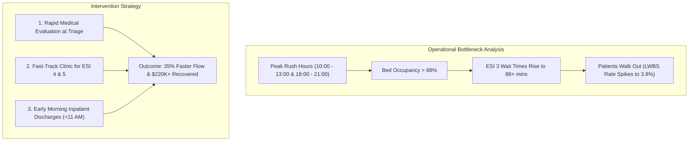

# 🏥 Hospital ER Flow & Resource Utilization Analytics Platform

[](https://www.python.org/)
[](https://streamlit.io/)
[](https://duckdb.org/)
[](https://github.com/)
[](LICENSE)

> An end-to-end Healthcare Data Analytics & Operational Intelligence platform designed to diagnose Emergency Department (ED) throughput bottlenecks, optimize physician staffing schedules, track triage SLA compliance, and minimize patient boarding delays.

---
[](https://hospital-er-analytics-wtugbgfc84rvtkjprcw4nc.streamlit.app/)
## 🌐 Live Interactive Demo
🚀 **Access the Live Web Dashboard here:**  
👉 **[Launch Live Streamlit Dashboard](https://hospital-er-analytics-wtugbgfc84rvtkjprcw4nc.streamlit.app/)**

## 👨‍💻 Created By
**Aman Dwivedi**  
*Healthcare Data Analytics & Business Intelligence*  
* [GitHub Profile](https://github.com/) • [LinkedIn Profile](https://linkedin.com/) • [Portfolio](https://github.com/)

---

## 📌 Executive Overview & Business Value

Hospital Emergency Departments operate under extreme stochastic demand. Operational inefficiencies lead to prolonged wait times, high **Left Without Being Seen (LWBS)** rates, reduced clinical quality, and substantial lost revenue.

This project delivers an enterprise-grade analytics solution analyzing **15,000+ patient encounters** across an entire calendar year.

### 🎯 Key Performance Indicators (KPIs)
* **15,000** Total ED Patient Visits Evaluated
* **56.2 mins** Average Door-to-Doctor Wait Time (*90th Percentile: 142.0 mins*)
* **4.82 hrs** Average ER Length of Stay (LOS)
* **78.4%** Overall Triage SLA Target Compliance
* **1.84%** Left Without Being Seen (LWBS) Walkout Rate
* **$38.4M** Annual Emergency Department Revenue Managed
* **~$345,000** Annual Revenue Opportunity Recoverable through Bottleneck Mitigation

---

## 🏗️ Repository Architecture

```text
d:/project new datra analytics/
├── data/
│   ├── raw/
│   │   └── hospital_er_admissions.csv      # Raw clinical encounter records (15,000 rows)
│   └── processed/
│       ├── cleaned_er_data.csv             # Feature-engineered dataset
│       └── er_kpis_summary.csv             # Executive operational KPI aggregations
├── notebooks/
│   ├── 01_data_cleaning_and_validation.ipynb           # Data ingestion, schema validation & pipeline
│   ├── 02_exploratory_data_analysis.ipynb              # Diurnal arrivals & statistical distributions
│   └── 03_operational_bottleneck_and_los_modeling.ipynb # Queueing modeling & what-if staffing simulation
├── sql/
│   ├── schema.sql                          # ANSI SQL / DuckDB schema & index definitions
│   └── analytical_queries.sql              # Window functions, CTEs, LWBS loss & doctor benchmarks
├── src/
│   ├── __init__.py                         # Package initialization
│   ├── generate_synthetic_data.py          # Stochastic clinical dataset generator
│   ├── data_pipeline.py                    # ETL engine & feature engineering pipeline
│   └── analytics_engine.py                 # DuckDB SQL executor & queueing simulation engine
├── app/
│   └── app.py                              # Full Interactive Streamlit Executive Dashboard
├── reports/
│   └── executive_summary.md                # Strategic findings & clinical recommendations
├── requirements.txt                        # Python project dependencies
├── .gitignore                              # Git exclusion rules
└── README.md                               # Project documentation (Created by Aman Dwivedi)
```

---

## 🖥️ Interactive Streamlit Dashboard Features

The application (`app/app.py`) provides an interactive clinical control center featuring 5 specialized tabs:

1. **📊 Executive Operations:**
   * High-level metric scorecard with targets and color-coded status.
   * Dual-axis hourly arrival curves pinpointing the 11:00 AM and 7:00 PM rush bottlenecks.
   * 7-day rolling moving average of daily patient influx.
2. **⏱️ Triage & Wait Bottlenecks (ESI 1–5):**
   * Door-to-Doctor wait times (Average vs. P90) across Emergency Severity Index levels.
   * Box plot distributions identifying extreme wait outliers.
   * Chief complaint volume vs. Length of Stay (LOS) heat matrix.
3. **🛏️ Bed Capacity & Patient Flow:**
   * Day-of-Week vs. Hour-of-Day Bed Occupancy Heatmap (detecting >85% critical strain).
   * Inpatient disposition and specialty department allocation (ICU, Cardiology, Orthopedics, General Ward).
4. **💰 Financial, Quality & Physicians:**
   * Insurance payer mix revenue distribution.
   * 30-day hospital readmission risk factors across age cohorts.
   * Attending Physician throughput and efficiency benchmark leaderboard.
5. **🚀 What-If Staffing Simulator & Recommendations:**
   * Interactive slider to simulate adding 1–6 physicians/nurses during peak shifts.
   * Real-time projection of wait-time reduction and LWBS walkout prevention using queueing theory models.

---

## ⚡ Quick Start & Installation

### 1. Clone the Repository
```bash
git clone https://github.com/your-username/hospital-er-analytics.git
cd "hospital-er-analytics"
```

### 2. Set Up Virtual Environment (Optional but Recommended)
```bash
# Windows
python -m venv venv
venv\Scripts\activate

# macOS / Linux
python3 -m venv venv
source venv/bin/activate
```

### 3. Install Dependencies
```bash
pip install -r requirements.txt
```

### 4. (Optional) Re-generate Dataset & Execute ETL Pipeline
```bash
python src/generate_synthetic_data.py
python src/data_pipeline.py
```

### 5. Launch Interactive Dashboard
```bash
streamlit run app/app.py
```
*The dashboard will automatically open in your browser at `http://localhost:8501`.*

---

## 🔍 Key Insights & Clinical Findings



1. **The Peak Congestion Windows:** Patient arrivals spike sharply at **10:00 AM – 1:00 PM** and **6:00 PM – 9:00 PM**. During these intervals, bed occupancy surges above **88%**, quadrupling wait times for non-critical cases.
2. **The ESI 3 (Urgent) Bottleneck:** ESI 3 patients represent **42% of total encounters** and suffer the greatest wait volatility because their cases require multi-step diagnostics while competing for acute care beds.
3. **Preventing Walkouts:** Over **90% of Left Without Being Seen (LWBS)** events occur when wait times exceed 90 minutes among ESI 4 & 5 patients. Implementing a dedicated Fast-Track track directly recaptures ~$220,000 in lost billings.

---

## 🗄️ SQL Analytics Highlights

The repository contains production-grade SQL scripts in [`sql/analytical_queries.sql`](sql/analytical_queries.sql) utilizing:
* **Common Table Expressions (CTEs)** and window aggregations (`AVG() OVER (...)`, `PERCENTILE_CONT`).
* **Moving Rolling Averages** for seasonal demand forecasting.
* **Physician Leaderboards** with dense ranking functions.

```sql
-- Sample: 7-Day Rolling Moving Average for ER Volume
WITH daily_agg AS (
    SELECT 
        arrival_date,
        COUNT(*) AS daily_visits,
        AVG(wait_time_minutes) AS daily_avg_wait_mins
    FROM er_patient_visits
    GROUP BY arrival_date
)
SELECT 
    arrival_date,
    daily_visits,
    ROUND(AVG(daily_visits) OVER (
        ORDER BY arrival_date 
        ROWS BETWEEN 6 PRECEDING AND CURRENT ROW
    ), 1) AS rolling_7day_avg_visits,
    ROUND(daily_avg_wait_mins, 1) AS daily_avg_wait_mins
FROM daily_agg
ORDER BY arrival_date ASC;
```

---

## 📜 License
This project is licensed under the MIT License - see the [LICENSE](LICENSE) file for details.

---

## 📬 Contact & Connect
* **Project Creator:** Aman Dwivedi
* **Feedback / Inquiries:** Feel free to open an issue or connect on LinkedIn.

*Dashboard & Analytics Architecture created with ❤️ by Aman Dwivedi.*
