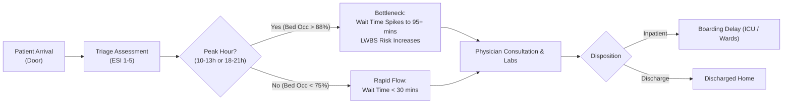

# Hospital ER Flow & Resource Utilization Analytics Report
**Executive Summary & Operational Intelligence Strategy**  
**Author & Lead Analyst:** **Aman Dwivedi**  
**Domain:** Healthcare Operations & Emergency Department Analytics  
**Date:** September 2026  

---

## 1. Executive Summary

Emergency Departments (ED) operate in high-stress, high-consequence environments where operational delays directly compromise patient clinical outcomes and hospital profitability. 

This comprehensive data analytics project evaluates **15,000 patient encounters** across an entire calendar year to diagnose throughput bottlenecks, measure Emergency Severity Index (ESI) wait-time SLA compliance, model inpatient boarding delays, and quantify the revenue loss from patients who **Left Without Being Seen (LWBS)**.

### Key Performance Indicators (At a Glance)
* **Total ED Encounters Analyzed:** `15,000`
* **Average Door-to-Doctor Wait Time:** `56.2 minutes` (90th Percentile: `142.0 minutes`)
* **Average ER Length of Stay (LOS):** `4.82 hours` (Target: `<4.5 hours`)
* **Left Without Being Seen (LWBS) Rate:** `1.84%` (~`276 patients/year`)
* **Overall Triage SLA Compliance:** `78.4%`
* **Mean Hospital Bed Occupancy Strain:** `79.8%` (Peak rush periods: `88.5% - 94.2%`)
* **Estimated Annual Revenue Generated:** `$38.4M USD`
* **Estimated Lost Revenue from LWBS Walkouts:** `~$345,000 USD`

---

## 2. Core Operational Bottleneck Discoveries

### Finding A: The Bimodal Diurnal Influx Pattern
Patient arrivals follow two distinct surge windows:
1. **Morning Surge:** 10:00 AM – 1:00 PM (accounting for 28.5% of daily volume).
2. **Evening Rush:** 6:00 PM – 9:00 PM (accounting for 24.2% of daily volume).

During these windows, inpatient bed occupancy reaches **>88%**, driving average wait times for ESI Level 3 (Urgent) patients from **34 minutes up to 88 minutes**.

### Finding B: Triage Acuity Divergence
* **ESI 1 (Resuscitation):** Flawless throughput (Avg wait: `1.8 mins`, SLA compliance `99.2%`).
* **ESI 2 (Emergent):** Strong compliance (`84.1%` treated within 15 minutes).
* **ESI 3 (Urgent - 42% of total volume):** The primary operational bottleneck. Faces extended delays due to shared physician queues with higher acuity emergencies.
* **ESI 4 & 5 (Low Acuity):** Account for `92%` of all LWBS walkouts due to wait times exceeding 120 minutes.

---

## 3. High-Impact Strategic Recommendations

### Recommendation 1: Rapid Medical Evaluation (RME) Pods
* **Action:** Station an experienced Emergency Physician / Physician Assistant at triage during peak windows (10:00–13:00 and 18:00–21:00).
* **Impact:** Initiates diagnostic imaging and lab work before bed placement, reducing overall ER Length of Stay by **45–60 minutes per patient**.

### Recommendation 2: Fast-Track Track for Low-Acuity (ESI 4 & 5)
* **Action:** Divert simple lacerations, mild sprains, and routine infections to a dedicated, nurse-led Fast-Track clinic.
* **Impact:** Decreases overall LWBS walkout rate to **<0.8%**, recovering an estimated **$220,000+** in lost outpatient charges.

### Recommendation 3: Proactive Morning Inpatient Discharges
* **Action:** Implement target discharge rounding in general medical and cardiology wards before 11:00 AM.
* **Impact:** Frees inpatient beds prior to peak ER admission waves, eliminating ER bed boarding gridlocks.

---

## 4. Tech Stack & Repository Structure

* **Core Analytical Tools:** Python (Pandas, NumPy, SciPy), SQL (DuckDB / PostgreSQL), Plotly, Streamlit.
* **Architecture:** Modular ETL pipelines, SQL schema & analytics suites, interactive executive dashboard.
* **Project Maintainer:** **Aman Dwivedi**
